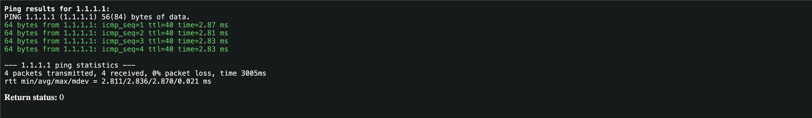
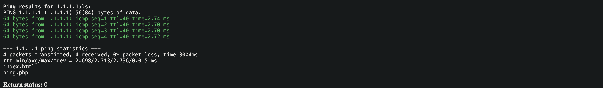
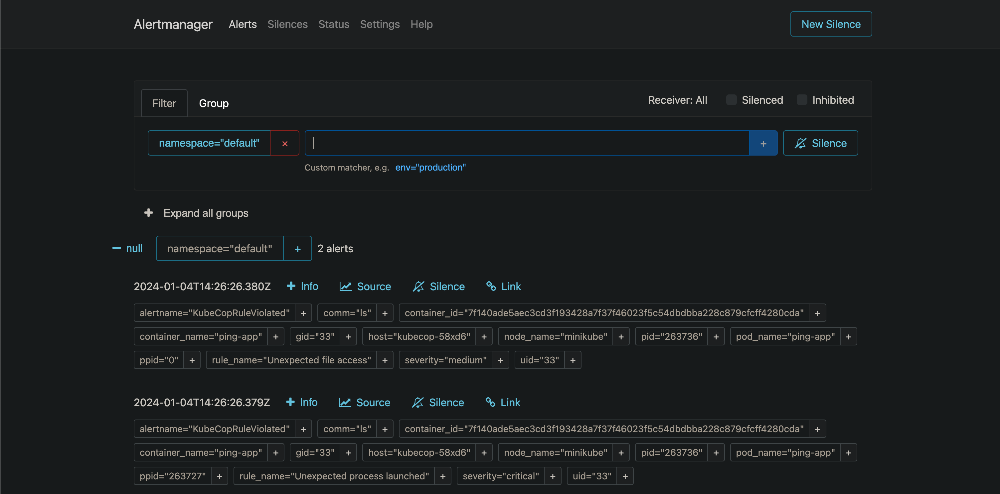
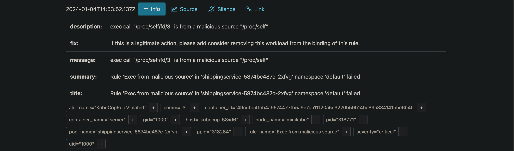

# <span>K8s</span> Sob Controle: <span>eBPF</span> e <span>Kubescape</span> para Segurança Total

Transformando a Segurança no Kubernetes com Monitoramento em Tempo Real e Contexto Inteligente.

<div class="pt-12">
  <span @click="$slidev.nav.next" class="px-2 py-1 rounded cursor-pointer" hover="bg-white bg-opacity-10">
    Vamos começar! <carbon:arrow-right class="inline"/>
  </span>
</div>


---
src: ../../pages/guisso-queisso.md
---
---
layout: iframe
url: https://sunsecrn.github.io
---

---

# O que você vai <span>aprender</span> hoje

<v-clicks depth="2">

- O que é <span v-mark="{ at: 1, type:'underline', color:'lightgreen'}">eBPF</span> e por que ele é revolucionário.
- Como o <span v-mark="{ at: 2, type:'underline', color:'lightgreen'}">Kubescape</span> usa eBPF para:
  - Detecção de ameaças em runtime.
  - Análise de vulnerabilidades (SCA).
- Demonstração prática: Node Agent em ação.
- Como priorizar ameaças e integrar segurança à cultura DevOps.

</v-clicks>

---

# O Problema da <span>Segurança</span> em Kubernetes

<v-clicks depth="2">

- <span v-mark="{ at: 1, type:'box', color:'red'}">Falta de tempo</span> para aprender novas ferramentas.
- Testes manuais e automatizadosque geram:
  - <span v-mark="{ at: 3, type:'box', color:'red'}">Falsos positivos</span> .
  - Relatórios <span v-mark="{ at: 4, type:'box', color:'red'}">difíceis de entender</span> .
  - <span v-mark="{ at: 5, type:'box', color:'red'}">Grandes backlogs</span>  sem priorização.
- Resultado:
  - "Já está funcionando, <span v-mark="{ at: 8, type:'circle', color:'lightgreen'}">não mexa!</span>"
  - 😎👍
  - Incidentes de segurança geram<span v-mark="{ at: 10, type:'circle', color:'lightgreen'}"> layoffs</span>.
  - 😱

</v-clicks>

---
layout: quote
---

# O que é <span>eBPF</span>?

> eBPF é uma tecnologia que permite executar programas em um contexto privilegiado, como o kernel do sistema operacional. eBPF significa Enhanced Berkeley Packet Filter, e é o sucessor do mecanismo de filtragem Berkeley Packet Filter (BPF) no Linux.


<a href="https://ebpf.io/what-is-ebpf/" class="px-2 py-1 rounded cursor-pointer no-underline" hover="bg-white bg-opacity-10">eBPF foundation</a>
---
layout: image

image: ./kernel.png
---
---
layout: image

image: ./ebpf-kernel.png
---
---

# O que é <span>eBPF</span>?

<v-clicks depth="2">

- Tecnologia que permite executar código no <span v-mark="{ at: 1, type:'underline', color:'lightgreen'}">kernel do Linux</span>.
- Captura <span v-mark="{ at: 2, type:'underline', color:'lightgreen'}">eventos</span> do sistema:
  - Chamadas de sistema.
  - Conexões de rede.
  - Acessos a arquivos.
- **Vantagens:**
  - <span v-mark="{ at: 7, type:'box', color:'lightgreen'}">Alta eficiência</span>, sem impacto na performance.
  - <span v-mark="{ at: 8, type:'box', color:'lightgreen'}">Visibilidade</span> profunda.
  - <span v-mark="{ at: 9, type:'box', color:'lightgreen'}">Monitoramento</span> em tempo real.

</v-clicks>

---

# <span>Kubescape:</span> Sua Mãe Protetora no Kubernetes
<v-clicks depth="2">

- Ferramenta que:
  - Monitora comportamento anômalo.
  - Detecta vulnerabilidades.
  - Prioriza ameaças críticas.
- **Semelhança com sua mãe:**
  - Dá contexto detalhado, como uma mãe no médico.
  - Identifica o que é realmente importante.

</v-clicks>
---

# Node Agent <span>Runtime Detection & Response</span>
## O que faremos:
<v-clicks>

1. Instalar o Node Agent.
2. Deploy de uma aplicação web e ataque a ela.
3. Deploy de malware sem arquivos.
4. Deploy de imagem maliciosa com malware.
5. Deploy de container minerando criptomoedas.
6. Ver como o Node Agent detecta os ataques.

</v-clicks>
---

# <span>Instalação</span> do Node Agent
<v-clicks>

1. Prepare um cluster Kubernetes (use Minikube ou Kind localmente).
2. Instale o Node Agent:
  ```bash
  helm repo add kubescape https://kubescape.github.io/helm-charts/
  helm upgrade --install kubescape kubescape/kubescape-operator -n kubescape --create-namespace \
    --set capabilities.runtimeDetection=enable \
    --set alertCRD.installDefault=true
  ```
3. Configure AlertManager para capturar os alertas.

</v-clicks>

---

# <span>Ataque e Detecção</span> com Node Agent

## Ataque 1: Aplicação Web Vulnerável

<v-clicks>

1. Deploy da aplicação:
  ```bash
    ./demo/general_attack/webapp/setup.sh
  ```


</v-clicks>

---

# <span>Ataque e Detecção</span> com Node Agent

## Ataque 1: Aplicação Web Vulnerável

<v-clicks depth="2">



2. Realizar ataque de injeção de comando:
  ```bash
    1.1.1.1;ls
  ```
  

</v-clicks>

---

# <span>Ataque e Detecção</span> com Node Agent

<v-clicks>



- **Node Agent detecta:**
  - Execução de comando inesperado.
  - Atividade de arquivo não autorizada.

</v-clicks>

---

# <span>Ataque e Detecção</span> com Node Agent
## Ataque 2: Mineração de Criptomoedas

<v-clicks depth="2">

1. Deploy de container minerando criptomoedas:
  ```bash
  kubectl apply -f demo/miner/miner-pod.yaml
  ```
2. Node Agent detecta:
  - Atividade de mineração.

</v-clicks>

---
layout: image
image: ./image-3.png
---
---

# <span>Ataque e Detecção</span> com Node Agent
## Ataque 3: Malware Sem Arquivo

<v-clicks depth="2">

1. Deploy de malware:
  ```bash
    kubectl apply -f demo/fileless_exec/kubernetes-manifest.yaml
  ```
2. Node Agent detecta:
  - Execução de malware diretamente da memória.
  

</v-clicks>

---

# <span>Benefícios</span> do Kubescape

<v-clicks depth="2">

- Reduz falsos positivos.
- Monitora eventos em tempo real.
- Prioriza ameaças críticas.
- Integra segurança de forma ágil ao DevOps.

</v-clicks>

---

# <span>Conclusão</span>
- eBPF e Kubescape transformam a segurança em Kubernetes.
- Com visibilidade profunda e monitoramento em tempo real:
  - **Proteja seus clusters.**
  - **Priorize o que importa.**
  - **Integre segurança à cultura DevOps.**

**Perguntas?** Vamos conversar!  
Me encontre no [LinkedIn](https://linkedin.com/in/fernandoguisso) ou no evento!  
