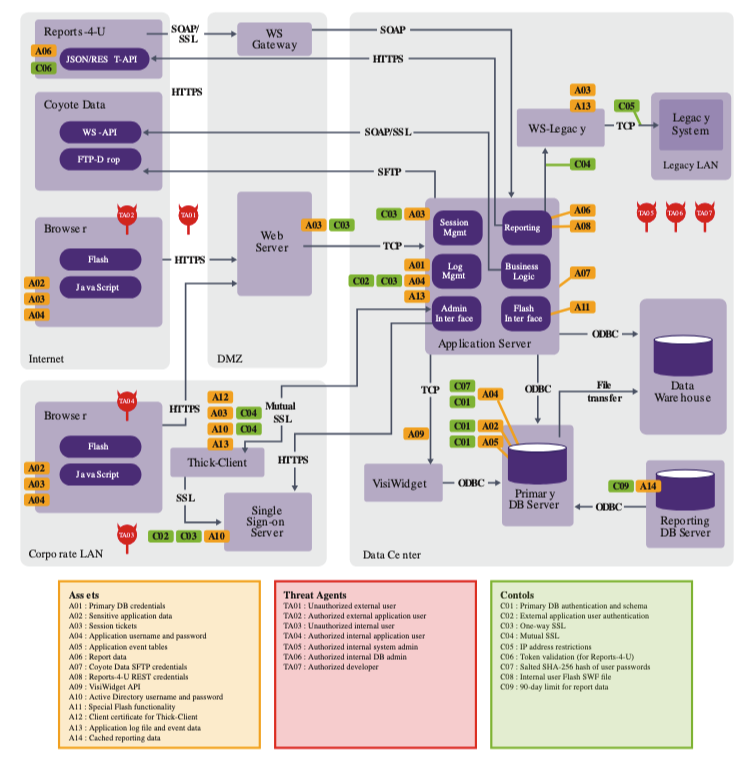

# Threat Modeling Express

Uma Nova Abordagem para Segurança Ágil

  
    Vamos começar! <carbon:arrow-right class="inline"/>
  

---
layout: quote
---

# O que é Threat Modeling?

> Threat Modeling é o processo de identificar ameaças, vulnerabilidades e contramedidas em sistemas, com o objetivo de minimizar os riscos e fortalecer a segurança ao longo do ciclo de vida do desenvolvimento.

---

# Origem do Threat Modeling

- 1960s: Exploração de vulnerabilidades em sistemas compartilhados.
- 1988: Robert Barnard desenvolve o primeiro perfil de atacante.
- 1994: Edward Amoroso propõe a árvore de ameaças ("threat tree").
- 1998: Bruce Schneier apresenta "attack trees" para sistematizar a análise de riscos cibernéticos.
- 1999: STRIDE é criado pela Microsoft.
- 2003: OCTAVE introduz uma metodologia centrada em operações.
- 2014: Ryan Stillions desenvolve o DML (Detection Maturity Level).
- **2020**: Publicação do [Manifesto de Threat Modeling](https://www.threatmodelingmanifesto.org/), destacando os valores e princípios essenciais para todos os modeladores de ameaças.
- **2024**: Lançamento do documento de [Capacidades de Threat Modeling](https://www.threatmodelingmanifesto.org/capabilities/), fornecendo um catálogo para maximizar o valor da prática de Threat Modeling.
---

# Crescimento no Mercado

- **Tendências atuais:**
  - Empresas adotando práticas de Threat Modeling no início do desenvolvimento.
- **Benefícios:**
  - Aumenta a visibilidade das ameaças desde o design.
  - Reduz custos de correção.
- **Impacto:** Comparado a outros testes de segurança, como pentests, o Threat Modeling atua de forma preventiva.

---
layout: iframe-right
url: https://www.threatmodcon.com/
---
# Conferência Internacional de Threat Modeling 2023

Definindo o futuro do Threat Modeling:

- **ThreatModCon**: Primeiro e único evento dedicado ao Threat Modeling.
- Mais de 100 empresas e 20 palestrantes internacionais discutindo as novas tendências.
- Exploração de aplicações diversas do Threat Modeling em segurança cibernética.

---

# Abordagens Tradicionais

- **STRIDE**: Criado em 1999 pela Microsoft para identificar ameaças de forma sistemática.
- **PASTA**: Simulação de ataques e análise de ameaças com foco em compliance.
- **Trike**: Modelo baseado em auditoria e gerenciamento de riscos.
- **VAST**: Usa diagramas de fluxo e DevOps para integrar o Threat Modeling.
- **Hybrid**: Combina várias metodologias, como SQUARE e Security Cards.

---

# Threat Modeling Express

- **Princípios fundamentais:**
  - Enfoque ágil e iterativo.
  - Colaboração constante entre times de segurança e desenvolvimento.
  - Fácil adaptação a ambientes DevSecOps.

---
layout: quote
---

# Processo do Threat Modeling Express

---

# Preparação e Engajamento da Equipe

- **Passo 1:** Alinhar a equipe com os objetivos de segurança.
- Criar uma cultura de segurança compartilhada e comunicação contínua.

---

# Criação do Data Flow

- **Passo 2:** Mapear os principais fluxos de dados no sistema.
- Identificar onde os dados críticos podem estar vulneráveis.

---

# Identificação de Ativos

- **Passo 3:** Determinar os ativos mais críticos para a segurança do sistema.
- Avaliar quais partes do sistema requerem proteção especial.

---

# Atores de Ameaça

- **Cibercriminosos**: Cometem crimes cibernéticos, como ataques de ransomware e phishing, visando principalmente ganhos financeiros.
- **Atores patrocinados por estados**: Trabalham em nome de governos para roubar dados sensíveis ou realizar espionagem e ataques cibernéticos contra infraestruturas críticas.
- **Hacktivistas**: Utilizam técnicas de hacking para promover agendas políticas ou sociais, como liberdade de expressão ou expor violações de direitos humanos.
- **Curiosos**: Atacam sistemas por diversão, para testar seus limites ou aprender mais sobre redes e sistemas. Inclui os "script kiddies", que usam ferramentas prontas para explorar vulnerabilidades.
- **Ameaças internas**: Atores internos que podem causar danos, seja por erro humano ou de forma maliciosa, como funcionários insatisfeitos que abusam de seus privilégios.
- **Ciberterroristas**: Atuam com motivações políticas ou ideológicas, utilizando ataques cibernéticos para ameaçar ou causar violência, seja em nome de estados ou grupos independentes.

---

# Atores de  Ameaça que nos esquecemos

Além dessas categorias tradicionais, em nossa empresa discutimos outras possibilidades de atores de ameaças. Um exemplo interessante são os **fãs de reality shows**, como os fãs de BBB. Eles organizam mutirões de votos em massa, podem derrubar votações ou promover campanhas de difamação online.

Se interessar, confira esta palestra da OWASP Global AppSec 2023 de onde tiramos a ideia de novos atores de ameaça:  
[The Threat Actors We Forgot to Model: Profiling Socially Motivated Cyber Criminals](https://owasp2023globalappsecwashin.sched.com/event/1M6Qh/the-threat-actors-we-forgot-to-model-profiling-socially-motivated-cyber-criminals)

Essa palestra explora como atores de ameaças motivados socialmente podem causar grandes impactos e são muitas vezes esquecidos nos modelos de ameaças.

---

# Tipos de Ameaças

Ao enumerar as ameaças, é fundamental se colocar na posição de cada **ator de ameaça** e pensar nas diversas maneiras de causar problemas ao sistema ou acessar os ativos ao longo de cada etapa do **dataflow**.

- **Abra a mente**: É essencial sair do seu ponto de vista habitual e pensar como um atacante, considerando as vulnerabilidades do sistema.
- Pergunte-se: "Se eu fosse um atacante, o que eu faria para comprometer este sistema?"
- Avalie cada parte do fluxo de dados, identificando onde as ameaças podem surgir.
- Pense em diferentes vetores de ataque, incluindo métodos menos óbvios, como a exploração de insiders, falhas humanas, e atores motivados socialmente.
  
Ao pensar dessa forma, você conseguirá enumerar ameaças mais abrangentes e mitigar potenciais riscos que poderiam ser negligenciados em uma análise superficial.

---

# Definição de Controles

- **Controles técnicos e processuais:** 
  - Implementar controles para mitigar ameaças identificadas.
  - Criar tarefas claras para o time de desenvolvimento executar.

---

# Ferramentas e Técnicas

- **Excalidraw**: Visualize fluxos de dados e identifique ameaças.
- **Integração com Jira e Trello**: Gerencie tarefas relacionadas ao Threat Modeling.

---

# Outras Ferramentas

- **Microsoft Threat Modeling Tool**: Baseada em DFD e STRIDE.
- **IriusRisk**: Ferramenta que mantém o modelo de ameaças durante o ciclo de vida.
- **securiCAD**: Simulação automática de ataques para análise de risco.
- **OWASP Threat Dragon**: Focada em desenvolvimento seguro com integração STRIDE.
- **OWASP pytm**: Framework em Python para Threat Modeling como código.

---

# Superando Desafios

- **Resistência inicial das equipes:** 
  - Educar e engajar todos os membros desde o início.
  
- **Adaptação de ferramentas e processos:**
  - Integração contínua com ferramentas já utilizadas pela equipe.

---

# Medindo o Sucesso

- **Métricas relevantes:**
  - Número de ameaças identificadas e mitigadas.
  - Redução de vulnerabilidades em produção.

- **Avaliação do impacto:**
  - Aumento na percepção de segurança e eficácia das contramedidas.

---

# O Futuro do Threat Modeling

- **Integração com DevSecOps:**
  - Tornar o Threat Modeling parte do pipeline de CI/CD.
  
- **Tendências emergentes:**
  - Automação do processo de Threat Modeling.
  - Uso de IA para detectar ameaças em tempo real.

---

# Conclusão

- **Recapitulação:** 
  - Threat Modeling Express oferece uma abordagem ágil e colaborativa para segurança.

- **Chamada à ação:**
  - Comece a implementar o Threat Modeling Express em seus projetos hoje mesmo.

---

# Obrigado!
### Contatos [guisso.dev](https://guisso.dev)
